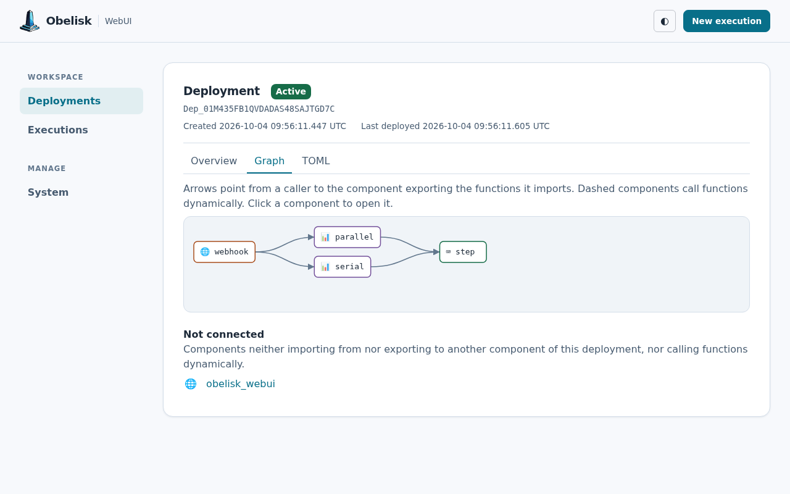
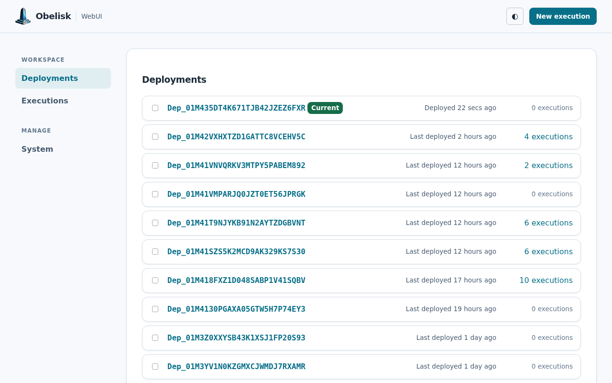
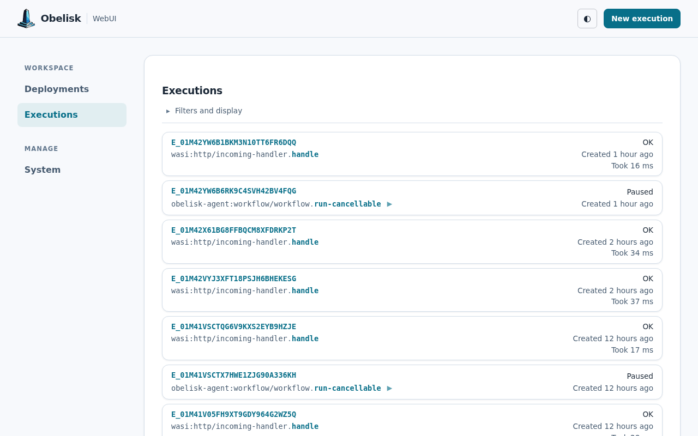
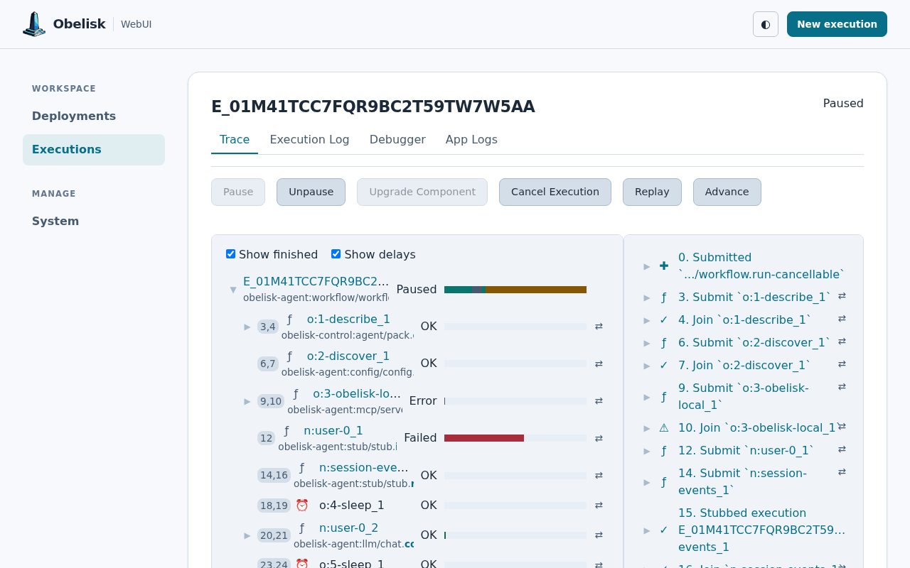
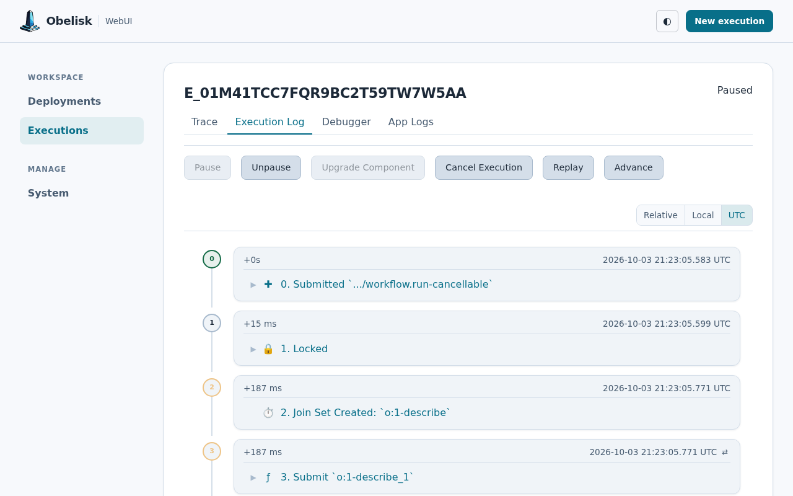
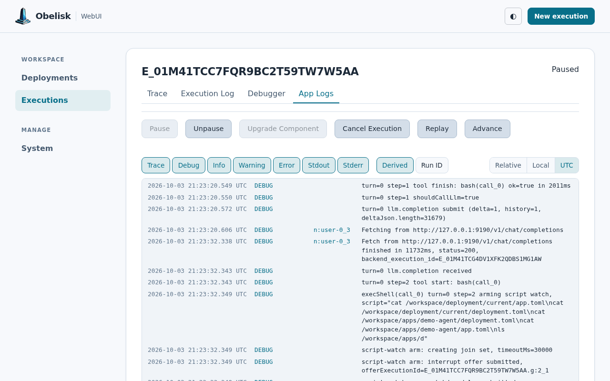
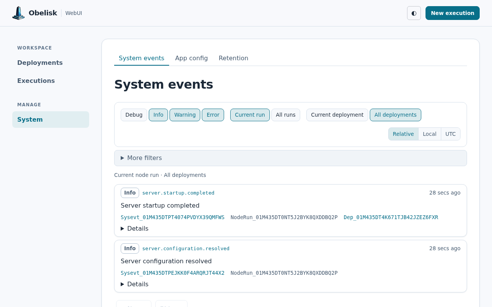

# Obelisk WebUI

A [Yew](https://yew.rs)-based web interface for [Obelisk](https://obeli.sk/), a deterministic workflow engine for durable execution.

## Features

- **Execution List** - Browse, filter, and paginate through workflow executions
- **Deployment List** - View deployment states and execution counts
- **Deployment Graph** - Inspect component dependencies, imports, and dynamic calls
- **Component List** - Explore registered components and their interfaces
- **Execution Detail** - Inspect execution events, traces, and logs
- **Debugger** - Step through execution history with source mapping
- **Workflow Actions** - Replay executions and upgrade to new component versions

## Screenshots

The Web UI included in Obelisk 0.42.0, running the
[demo-tutorial](https://github.com/obeli-sk/demo-tutorial) deployment, with the other views showing a real
[workflow-agent](https://github.com/obeli-sk/workflow-agent) session.



<details>
<summary>Deployments, executions, trace, application logs, and system logs</summary>

### Deployments



### Executions



### Execution trace



### Execution log



### Application logs



### System logs



</details>

The [capture script](https://github.com/obeli-sk/website/blob/main/scripts/screenshot-webui.js)
uses the server's embedded Web UI and REST API, with `OBELISK_API_TOKEN` for authentication.

## Development

Make sure to fetch the submodule:
```sh
git submodule init
git submodule update
```

### Prerequisites

This project uses [Nix flakes](https://nixos.wiki/wiki/Flakes) for dependency management.

```bash
# Install Nix (recommended: Determinate Systems installer)
curl --proto '=https' --tlsv1.2 -sSf -L https://install.determinate.systems/nix | sh -s -- install

# Configure Cachix cache for faster builds
cat << 'EOF' | sudo tee -a /etc/nix/nix.conf
extra-substituters = https://obeli-sk.cachix.org
extra-trusted-public-keys = obeli-sk.cachix.org-1:31iM9GWSEhAXvvuTWQ7CvAcwvgRzsuJ9yJghywSd3Jw=
EOF
sudo systemctl restart nix-daemon.service
```

### Running Locally

Enter the Nix development shell and start the development server:

```bash
nix develop
just serve
```

The WebUI will be available at [http://localhost:8081](http://localhost:8081).

Make sure the Obelisk REST API is running at `http://127.0.0.1:8080`.

### Building for Release

```bash
nix develop
just build
```

This creates:
- Release WASM files in `crates/webui/dist/`
- The static asset and same origin API gateway component at `target/wasm32-wasip2/release/webui_proxy.wasm`

See [webui-proxy README](crates/webui-proxy/README.md) for deployment instructions.

## Project Structure

```
webui/
├── crates/
│   ├── webui/              # Main WebUI application (Yew + WASM)
│   └── webui-proxy/        # Webhook component for serving WebUI
├── obelisk/                # Git submodule with proto definitions
├── Justfile                # Build commands
└── flake.nix               # Nix development environment
```

## License

AGPL-3.0-only - See [LICENSE-AGPL](LICENSE-AGPL) for details.
